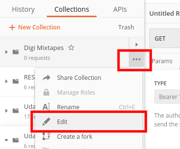
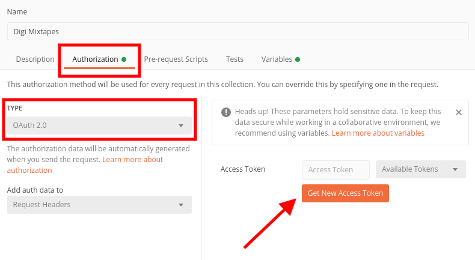
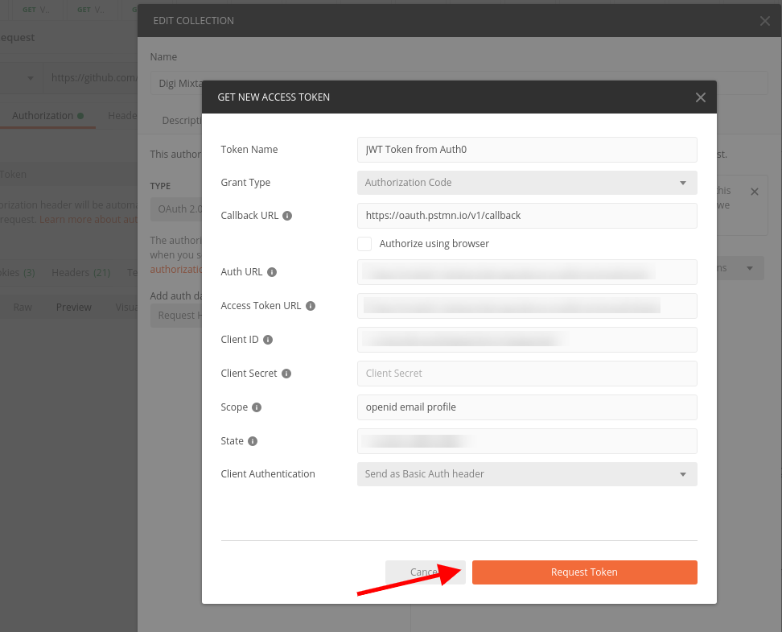

# 1 About Digi Mixtapes

## 1.1 Purpose 
This project is an exercise for a serverless application. It is the backend part of an app that allows a logged-in user to create "mixtapes", collections of songs.

## 1.2 Technology
The project is configured with the [Serverless Framework](https://www.serverless.com/), a framework that allows to create resources for and deploy code to different cloud providers. For Digi Mixtapes AWS is used.
 
**Used services**
- [AWS Lambda](https://aws.amazon.com/de/lambda/) to run the code without thinking about (provisioning or managing) servers
- [Amazon S3](https://aws.amazon.com/s3/) to easily store and access files (the mixtape songs) 
- [Amazon DynamoDB](https://aws.amazon.com/de/dynamodb/) as easily scalable cloud-native NoSQL database
- [Amazon API Gateway](https://aws.amazon.com/de/api-gateway/) to allow access to the app through a REST API
- [Auth0](https://auth0.com/) as identity provider to allow for users to authenticate with the app


# 2 Functionality

This repository contains the backend part of the application.

## 2.1 Core
- Users need to login to use the app 
- Users can create, update & remove mixtapes
- Removing a mixtape removes all songs within it  
- Within a mixtape they can add songs to the end or remove songs
- Users only have access to their own mixtapes & songs 

## 2.2 REST API

### Mixtapes
- `GET /mixtapes` List all your mixtapes
- `POST /mixtapes` Create a new mixtape
- `PATCH /mixtapes/<mixtape-id>` Update a mixtape by id (e.g. the name)
- `DELETE /mixtapes/<mixtape-id>` Delete a mixtape by id

### Songs
- `GET /mixtapes/<mixtape-id>/songs` Get list of all songs for a mixtape and the mixtape's details 
- `POST /mixtapes/<mixtape-id>/songs` Create a song in a mixtape (added to the end)
- `POST /mixtapes/<mixtape-id>/songs/<song-id>/upload-url` Obtain a signed url to upload a song into the S3 bucket
- `DELETE /mixtapes/<mixtape-id>/songs/<song-id>` Delete a song by id

## 2.3 Testing
As there is no front-end implementation in this repository, the API can be tested with [Postman](https://www.postman.com/downloads/). 

### 2.3.1 Running the Postman Collection
There is a [Postman collection](./Digi-Mixtapes-API.postman_collection.json) which contains mixtape and song related sample requests for relevant API calls including tests that can be run for the whole collection.
 
 **Environment Variables**  
There are three variables set on collection level which would normally be defined as environment variables. However, for simplicity they are set as collection variables. This way, the collection can be run directly after import into Postman, without setting any more variables manually.

- **dm_baseUrl**: `https://<api-id>.execute-api.<region>.amazonaws.com/dev` The digi mixtapes api gateway url
- **dm_authToken**: the JWT token required for all API calls - the initial value is already set with a valid token for an example user 1; for obtaining a new JWT token, see 2.3.2
- **dm_authTokenForSecondUser**: same as above but for a different user in order to test whether mixtapes from user 1 would show up for user 2

**Collection Variables**    
Some collection variables (that store ids) allow to add songs for recently created mixtapes or delete these, other variables allow for testing responses against json schemas stored in collection variables.


### 2.3.2 Obtaining New JWT Token
Without a front-end implementation in this repository which would allow a user to login and obtain a JWT token in the browser, we need to login and obtain a JWT token in a different way. Postman allows for using OAuth2 authorization with identity providers (the Digi Mixtapes app uses Auth0). To obtain a new JWT token authenticating with Auth0 go through these steps:

- Edit the Postman Digi Mixtapes collection by clicking the three dots and Edit  
  
- Go to the Authorization tab
- Temporarily change the type from **Bearer Token** to **OAuth 2.0**
- On the right click **Get New Access Token**  
  
- In the form that opens in a small window enter the following details:
    - **Token Name**: JWT Token from Auth0
    - **Grant Type**: Authorization Code
    - **Callback URL**: https://oauth.pstmn.io/v1/callback
    - **Authorize using browser**: leave unchecked
    - **Auth URL**: https://digi-mixtapes.eu.auth0.com/authorize
    - **Access Token URL**: https://digi-mixtapes.eu.auth0.com/oauth/token
    - **ClientID**: ZSozLg2IKNkF9kAvLqQord6j5yWPtW9L
    - **Client Secret**: leave empty
    - **Scope**: openid email profile
    - **State**: any random string or empty
    - **Client Authentication**: Send as Basic Auth header
- Click **Request Token**  
  
- Copy the **id_token**, which is the JWT token
- Close the small window
- Cancel to close the collection edit window

To set the token in the environment variables:

- Edit the Postman Digi Mixtapes collection by clicking the three dots and Edit  
- Go to Variables and update the current value of authToken or authTokenForSecondUser with the copied JWT token


# 3 Installing & Running The App

## 3.1 Prerequisites

- Serverless is installed (check with `serverless version` or short `sls version`)
- Node.js & npm are installed (check with `node -v` and `npm -v`)
- Sufficient rights to an AWS account and to the AWS Management Console
- If the serverless app should be run offline, java runtime environment needs to be installed and in the path (`java --version`)

## 3.2 Commands

### Configure IAM User

In order for Serverless Framework to deploy, set up a user in [IAM](https://aws.amazon.com/iam/) with sufficient rights, named e.g. "serverless" and save the access key and secret key. Then run the following command to configure the user for Serverless Framework:

```
sls config credentials --provider aws --key <key> --secret <secret> --profile serverless
```

*This creates user & credentials in your home directory ~/.aws/credentials and ~/.aws/config*

### Installation

To install the app on AWS, run the following commands from the base directory:

```
npm install
sls deploy -v
```

If the serverless command fails because of the wrong user, provide the profile explicitly:
 
```
sls deploy -v --aws-profile serverless
```

**Note:** Serverless Framework doesn't create the services directly in AWS but creates a [CloudFormation](https://aws.amazon.com/cloudformation/) template. From this template a CloudFormation stack is created which contains all the services.  
If you want to inspect what's created, you can do so using AWS console. And if anything goes wrong, you can also check the related CloudFormation stack in AWS Management Console.

### Update

To update the app, run the same command:

```
sls deploy -v
```

### Removing

To remove all functions, resources (DynamoDB tables, S3 buckets), roles, etc., run the following command:  

```
sls remove -v
```

### Running The App Locally/Offline

See the "SERVERLESS OFFLINE" comments in [serverless.yml](./serverless.yml) and prepare the code.

**Install and run DynamoDB locally**  
Note that java runtime needs to be installed and in the path for this to work. 

```
sls dynamodb install
sls dynamodb run 
```

**Run the app locally**

```
sls offline
```
